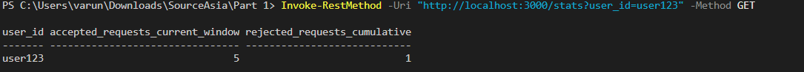

<h3 align="center">Source Asia — Backend Assignment</h3>

<div align="center">


A production-aware backend built with **Node.js** and **Express**, split into two independent services to ensure clean separation of concerns.

</div>

<div align="center"></div>


<h3 align="center">Prerequisites</h3>


<div align="center">

| Requirement | Version |
|---|---|
| Node.js | v14 or higher |
| npm | Included with Node.js |
| Terminal | PowerShell (Windows) or Bash (Mac/Linux) |

</div>

<div align="center"></div>

<h3 align="center">Folder Structure</h3>

```text
SourceAsia/
├── Part 1/
│   ├── server.js
│   └── package.json
├── Part 2/
│   ├── server.js
│   └── package.json
├── assets/
│   ├── 200 OK.png
│   ├── 429 Too Many Requests.png
│   ├── GET products.png
│   ├── GET products 1.png
│   ├── POST products.png
│   ├── POST products 1 media.png
│   └── stats.png
└── README.md
```

<div align="center"></div>

<h3 align="center">Part 1 — Rate-Limited API</h3>


<div align="center">

Restricts each user to a maximum of **5 requests per 60-second window** using an in-memory fixed window strategy.

</div>

<div align="center"></div>

<h3 align="center">Setup & Run</h3>


```bash
cd "Part 1"
npm install
node server.js
# Server starts on http://localhost:3000
```

<div align="center"></div>

<h3 align="center">Architecture</h3>


<div align="center">1. Fixed Window Strategy - A 60-second window is tracked per user. Once the window expires, the counter resets to zero automatically.</div>

<br>

<div align="center"><b>2. Status Codes</b></div>

<br>

<div align="center">

| Code | Meaning |
|---|---|
| 200 OK | Request accepted within the rate limit |
| 429 Too Many Requests | Limit exceeded — includes a JSON error body |

</div>

<br>

<div align="center"> 3. Concurrency Safety - Node.js runs on a single-threaded event loop. All reads and writes to the in-memory <code>Map</code> are synchronous, making race conditions impossible in this environment.</div>

<br>

<div align="center"><b>4. Production Considerations</b></div>
<br>

<div align="center">

| Limitation | Recommended Fix |
|---|---|
| State lost on server restart | Replace `Map` with Redis for persistence |
| Single-instance only | Redis also solves cross-instance state sharing behind a load balancer |

</div>

<div align="center"></div>

<h3 align="center">API Demo</h3>


<div align="center">

| Screenshot | Description |
|---|---|
|  | Successful request — 200 OK |
|  | Rate limit exceeded — 429 Too Many Requests |
|  | User statistics — /stats |

</div>

<div align="center"></div>

<h3 align="center">Testing</h3>

<div>*Run these in a separate PowerShell terminal while the server is running.</div>

<br>

**1.POST /request** — Send a request (run 6 times to trigger the 429):

```powershell
Invoke-RestMethod -Uri http://localhost:3000/request `
  -Method POST `
  -Headers @{"Content-Type"="application/json"} `
  -Body '{"user_id": "user123", "payload": {"data": "test"}}'
```

**2.GET /stats** — Check usage for a user:

```powershell
Invoke-RestMethod -Uri "http://localhost:3000/stats?user_id=user123" -Method GET
```

<div align="center"></div>

<h3 align="center">Part 2 — Product Catalog</h3>

<div align="center">

An in-memory catalog API for managing products and associated media URLs, with strict list-vs-detail performance optimizations.

</div>

<div align="center"></div>

<h3 align="center">Setup & Run</h3>

```bash
cd "Part 2"
npm install
node server.js
# Server starts on http://localhost:3001
```

<div align="center"></div>

<h3 align="center">Data Model & Performance</h3>


<div align="center">1. Storage - Products are stored in an in-memory <code>Map</code> keyed by a unique auto-incremented ID.</div>

<br>

<div align="center">2. List Endpoint — GET /products - Returns only core fields and media counts (<code>image_count</code>, <code>video_count</code>). Full URL arrays are intentionally omitted to guarantee O(1) serialization cost per product, regardless of how many media items exist.</div>

<br>

<div align="center">3. Detail Endpoint — GET /products/{id} - Returns the complete product object, including full <code>image_urls</code> and <code>video_urls</code> arrays.</div>

<br>

<div align="center"><b>4. Production Considerations</b></div>

<br>
<div align="center">

| Concern | Recommended Solution |
|---|---|
| Storage | PostgreSQL — `products` table + `product_media` table with foreign key |
| List performance | Optimized `COUNT()` grouping query on the media table |
| Media hosting | AWS S3 + CDN (Cloudflare or CloudFront) for global low-latency delivery |

</div>

<div align="center"></div>

<h3 align="center">API Demo</h3>


<div align="center">

| Endpoint | Screenshot |
|---|---|
| Create a product — POST /products |  |
| Append media — POST /products/1/media |  |
| List all products — GET /products (counts only, no URL arrays) |  |
| Full product detail — GET /products/1 |  |

</div>

<div align="center"></div>

<h3 align="center">Testing</h3>

*Run these commands sequentially in a PowerShell terminal.

**1. Create a new product:**

```powershell
Invoke-RestMethod -Uri http://localhost:3001/products `
  -Method POST `
  -Headers @{"Content-Type"="application/json"} `
  -Body '{"name": "Widget A", "sku": "SKU-001", "image_urls": ["https://cdn.example.com/img1.jpg"]}'
```

**2. Append a video to the product (ID: 1):**

```powershell
Invoke-RestMethod -Uri http://localhost:3001/products/1/media `
  -Method POST `
  -Headers @{"Content-Type"="application/json"} `
  -Body '{"video_urls": ["https://cdn.example.com/demo.mp4"]}'
```

**3. List all products (observe: arrays omitted, counts shown):**

```powershell
Invoke-RestMethod -Uri "http://localhost:3001/products" -Method GET
```

**4. Get full product detail:**

```powershell
Invoke-RestMethod -Uri "http://localhost:3001/products/1" -Method GET
```

<div align="center"></div>
